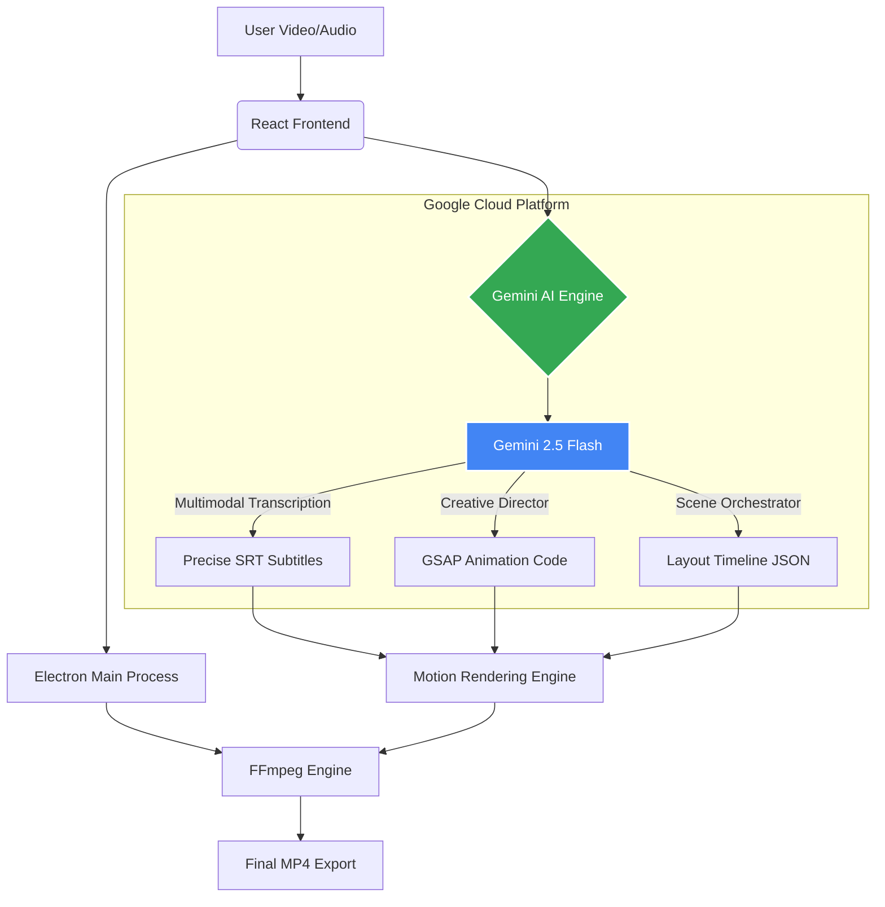

# Motionify


**Motionify** is a professional desktop app that transforms raw talking-head footage into high-retention **Edutainment** content (Instagram Reels / TikToks / YouTube Shorts).

It combines **Google Gemini AI**, **FFmpeg**, and **GSAP animations** to auto-generate broadcast-quality motion graphics, captions, and B-Roll overlays — all from your transcript.

> **Built with:** Electron + React 19 + TypeScript + Tailwind CSS + FFmpeg + GSAP + Gemini AI

## 🏗️ System Architecture

Motionify utilizes a hybrid architecture that combines the local performance of Electron with the multimodal reasoning of Google Gemini on Vertex AI.



### How the Gemini Integration Works:
1.  **Frontend (React)**: Captures user input (video/brief) and sends it to the `geminiService`.
2.  **API Layer (Google GenAI SDK)**: Communicates securely with Google Cloud. We use `gemini-1.5-flash` for high-speed, cost-effective multimodal work.
3.  **Multimodal Execution**:
    - **Vision/Audio**: Gemini analyzes the uploaded video file to extract precise timestamps for subtitles.
    - **Reasoning**: Based on the transcript, Gemini acts as a "Creative Director," generating custom GSAP (GreenSock) animation code specifically for the video's content.
4.  **Backend (Electron/FFmpeg)**: The generated code is dynamically injected into an overlay layer. Our FFmpeg pipeline then captures these animations frame-by-frame and merges them with the original video.


---

## ✨ Key Features

| Feature | Status | Description |
|---------|--------|-------------|
| **AI Scene Generation** | ✅ Ship | Gemini analyzes transcript → generates HTML5/GSAP animation overlays |
| **Pro Animated Captions** | ✅ Ship | 10 viral caption styles (Karaoke, Pop-In, Boxed, Glow, Netflix, etc.) |
| **AI Smart B-Roll** | ✅ Ship | Gemini suggests keywords → Pexels API → one-click stock footage insert |
| **Native FFmpeg Export** | ✅ Ship | Frame-by-frame Canvas 2D → FFmpeg pipeline, lossless quality |
| **Dynamic Split Layouts** | ✅ Ship | AI-driven layout changes (full-video, full-html, split with custom ratio) |
| **Template Gallery** | ✅ Ship | Pre-built GSAP animation templates (Tech, Business, Creative, etc.) |
| **Auto SRT Generation** | ✅ Ship | Gemini transcribes audio/video → generates SRT subtitles |
| **Background Music** | ✅ Ship | Upload BG music with volume control, auto-synced to video timeline |
| **Project Library** | ✅ Ship | Save/load projects with IndexedDB persistence |
| **Visual Code Editor** | ✅ Ship | Prism.js syntax-highlighted HTML editor with search & format |
| **Visual Timeline** | ✅ Ship | Timeline with subtitle, layout, and seek controls |
| **Asset Manager** | ✅ Ship | Upload images/videos referenced in HTML animations |
| **Offline HTML** | ✅ Ship | Inline all CDN resources for offline export (Electron-only) |
| **Audio Extraction** | ✅ Ship | Extract WAV from video for external transcription services |
| **TTS Generation** | ✅ Ship | Text-to-speech via Gemini for audio-only workflows |
| **Face Tracking Auto-Zoom** | 🔜 Next | MediaPipe face detection → cinematic Ken Burns zoom/pan |

---

## 🎨 10 Caption Styles

Pick from the **Media → Subtitles** tab:

| Style | Effect |
|-------|--------|
| 🎤 Karaoke | Yellow highlight + glow on active word |
| 💥 Pop-In | Words scale up as they appear |
| 🟨 Boxed Highlight | Active word gets yellow background |
| ⌨️ Typewriter | Words appear sequentially with blinking cursor |
| 🏀 Bounce Drop | Words drop in from above with spring physics |
| ✨ Glow Pulse | Neon green pulsating glow effect |
| 🔥 Emoji React | Random emoji pops beside each active word |
| 🌈 Split Color | Active word gets red→orange gradient |
| 〰️ Underline Sweep | Purple underline sweeps under the word |
| 🎬 Netflix | Clean, bold fade — one chunk at a time |

All styles render pixel-perfect in both **live preview** and **FFmpeg export**.

---

## 🎬 AI Smart B-Roll

Open **Media → 🎬 B-Roll** tab:

1. **AI Suggest** — Gemini reads your transcript and suggests 4–8 stock footage keywords with time ranges
2. **Pexels Search** — Search millions of free stock videos/photos
3. **One-Click Insert** — Click "Insert" to add B-Roll at the specified timestamp
4. **Live Preview** — B-Roll renders as fullscreen overlay with photographer credit

Requires a free [Pexels API key](https://www.pexels.com/api/new/). Set via the app or in `.env`:
```
VITE_PEXELS_API_KEY=your_key_here
```

---

## 🚀 Getting Started

### Prerequisites
- Node.js v18+
- macOS or Windows

### Installation

```bash
git clone https://github.com/Noman654/Motionify
cd motionify
npm install
```

### Run in Development

```bash
# Web-only (Vite dev server)
npm run dev

# Desktop app (Electron + Vite)
npm run electron:dev
```

### Build for Production

```bash
# macOS
npm run electron:pack

# Windows
npm run electron:build:win
```

### API Keys

| Key | Where | Purpose |
|-----|-------|---------|
| **Gemini API Key** | Settings panel or `config.ts` | AI scene generation, SRT, B-Roll suggestions |
| **Pexels API Key** | B-Roll panel or `.env` | Stock video/photo search |

Get your free [Gemini API Key](https://aistudio.google.com/app/apikey) and [Pexels API Key](https://www.pexels.com/api/new/).

---

## 🏗️ Architecture

```
├── App.tsx                    # Root component, state orchestration
├── components/
│   ├── ReelPlayer.tsx         # Live preview (video + HTML overlay + captions + B-Roll)
│   ├── ExportModal.tsx        # FFmpeg export (Canvas 2D frame-by-frame)
│   ├── EditorPanel.tsx        # Right sidebar (Design, Code, Media tabs)
│   ├── CaptionStylePicker.tsx # 10 caption style selector
│   ├── BRollPanel.tsx         # AI B-Roll suggestions + Pexels search
│   ├── FileUpload.tsx         # Video/SRT upload + auto-SRT + TTS
│   ├── VisualTimeline.tsx     # Bottom timeline with seek/subtitle display
│   ├── TemplateGallery.tsx    # Pre-built animation templates
│   ├── ProjectLibrary.tsx     # Save/load projects
│   └── WelcomeScreen.tsx      # Onboarding + API key setup
├── services/
│   ├── geminiService.ts       # Gemini AI (SRT, scene gen, TTS)
│   ├── pexelsService.ts       # Pexels stock footage API
│   └── brollService.ts        # Gemini B-Roll keyword analysis
├── utils/
│   ├── captionStyles.ts       # 10 caption styles (preview + export renderers)
│   ├── templates.ts           # GSAP animation templates
│   ├── srtParser.ts           # SRT subtitle parser
│   ├── promptTemplates.ts     # Gemini prompt engineering
│   ├── audioHelpers.ts        # WAV extraction
│   └── projectStorage*.ts     # IndexedDB persistence
├── electron/
│   ├── main.cjs               # FFmpeg pipeline + overlay capture
│   ├── preload.cjs            # IPC bridge
│   └── htmlInliner.cjs        # Offline HTML inlining
└── types.ts                   # TypeScript interfaces
```

---

## 🛠️ Tech Stack

| Layer | Technology |
|-------|------------|
| **Frontend** | React 19 + TypeScript |
| **Styling** | Tailwind CSS v4 |
| **Desktop** | Electron 40 |
| **Video** | FFmpeg (fluent-ffmpeg + ffmpeg-static) |
| **Animation** | GSAP (GreenSock) |
| **AI** | Google GenAI SDK (Gemini 2.5 Flash / Pro) |
| **Stock Media** | Pexels API |
| **Code Editor** | react-simple-code-editor + Prism.js |
| **Icons** | Lucide React |
| **Build** | Vite 6 + electron-builder |

---

## 📋 The "Pro" Workflow

1. **Record & Clean** — Record your video. Enhance audio via [Adobe Podcast](https://podcast.adobe.com/enhance)
2. **Transcribe** — Upload SRT or let Gemini auto-generate subtitles
3. **Compose** — Drop video + SRT → write a "Director's Brief" → Generate
4. **Style** — Pick a caption style, add B-Roll, tweak animations
5. **Export** — Native FFmpeg export at 1080×1920 @ 30fps

---

*Built for creators who refuse to choose between quality and quantity.*
